# Built with Elements

**One React tree → email, web page, and print PDF.** Eight templates built with
[`@unlayer/react-elements`](https://github.com/unlayer/elements): four original
*showcase* concepts that each do a genuinely different job on every surface, and
four *transactional* workhorses. Every render comes from one component tree, using
only Elements' fixed block set (rows, columns, heading, paragraph, button, image,
divider, table, social).

> Submission for Unlayer's **#BuiltWithElements** challenge.

**▶ Live showcase site** — open `index.html` (or deploy the repo to GitHub Pages / Vercel): browse every template across all three surfaces, **export the print PDF**, and **send a test email**, all from one page.

---

## Showcase — four original concepts

Not another receipt. Each of these uses the three surfaces for three different jobs —
a teaser, a scroll-story, a printable artifact — which is the whole point of writing
once and rendering three ways.

### 01 · Cadence — *"Your Year in Motion"*
A Wrapped-style running recap. The email is a teaser; the **web** is a bold scroll-story
(12-month bar chart, elevation profile, an orange persona payoff); the **PDF** is a
frame-it poster of the year.

| Email | Web (★) | Print PDF |
|---|---|---|
| 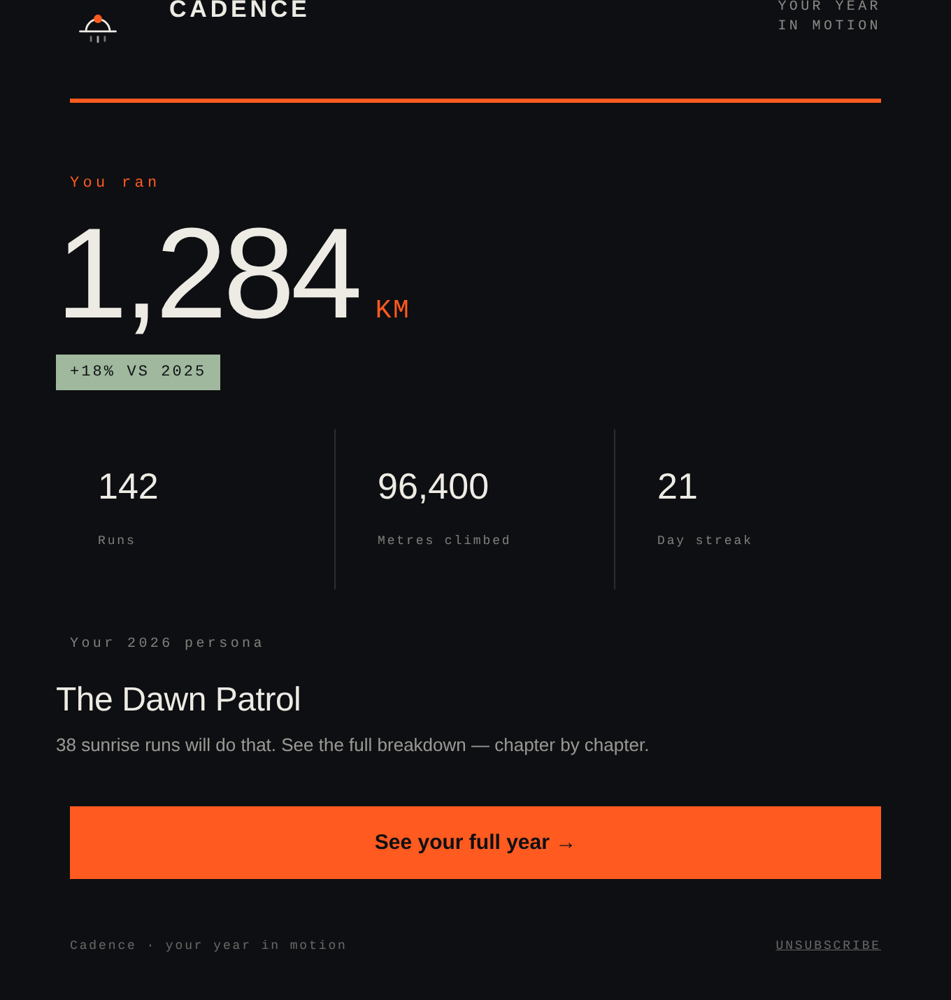 | 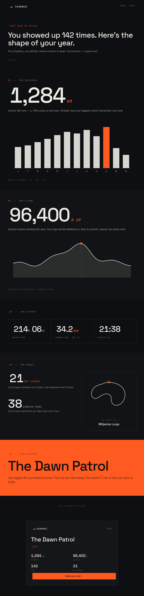 | 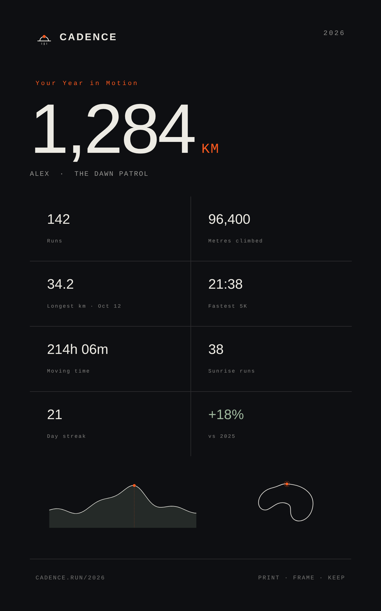 |

### 02 · SPORE — *a field-guide deck*
Collectible fungi cards. The email is a **"+3 unlocked"** reveal; the web is the
collection gallery; the **PDF** is a print-and-cut sheet with card backs. One reusable
card unit — silhouette, italic binomial, rarity pip, a four-stat block, a line of flavor.

| Email | Web | Print PDF (★) |
|---|---|---|
| 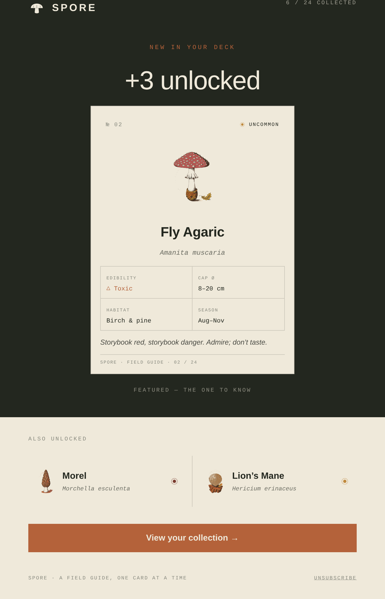 | 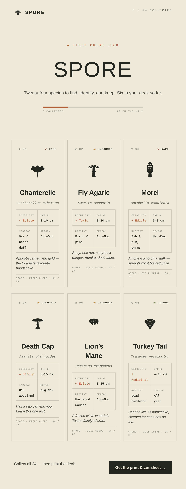 | 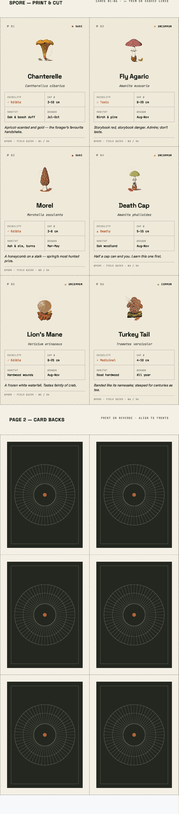 |

### 03 · Nocturne — *a dark-academia exhibition*
An identity for the painter *Elias Vaughn* at The Aldous Institute. The one serif-led
world (EB Garamond), gilt the only light. An opening **invite**, an **exhibition page**,
and a **bi-fold gallery guide** PDF with a floor plan and works checklist.

| Email | Web | Print PDF (★) |
|---|---|---|
| 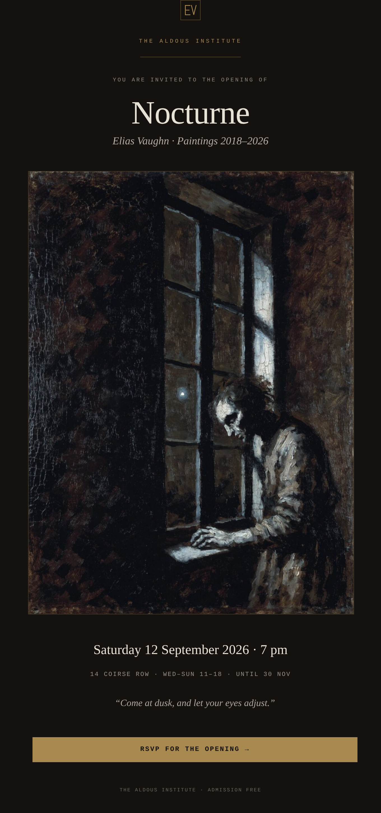 | 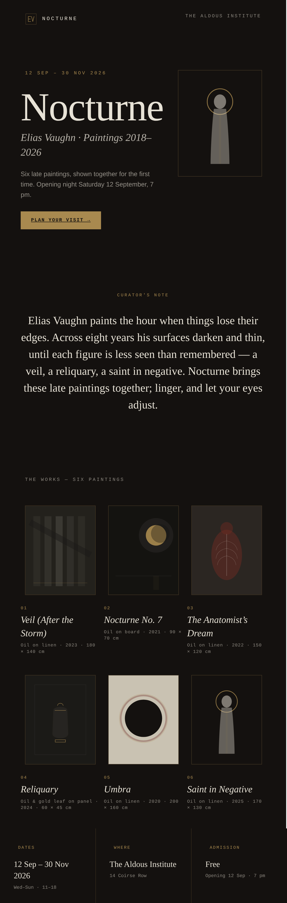 | 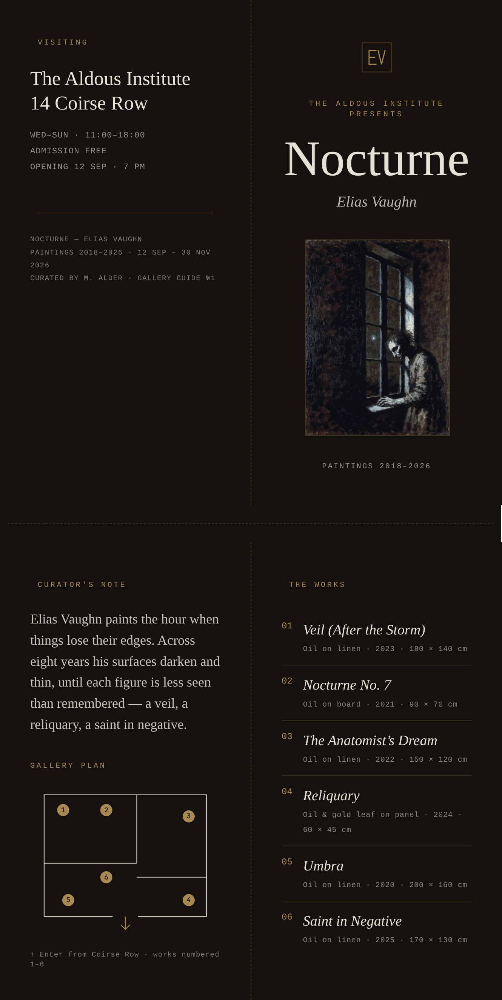 |


### 04 · Mise — *recipe of the week*
The email is a teaser; the web is the full recipe page; the **PDF** is a printable **4×6
index card** (front + back) you clip for the recipe box.

| Email | Web | Print PDF (★) |
|---|---|---|
| 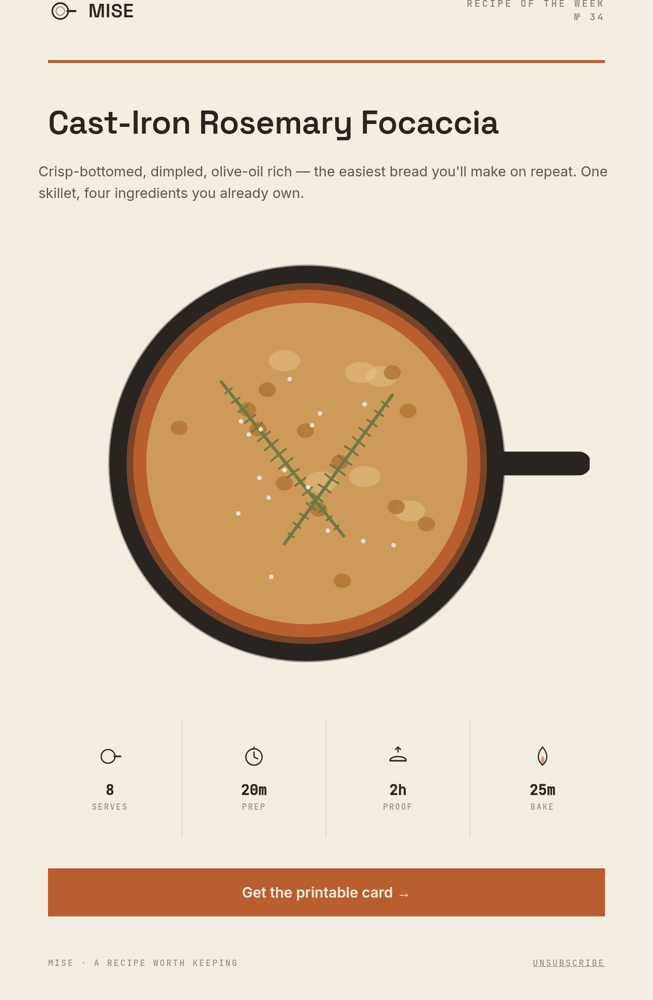 | 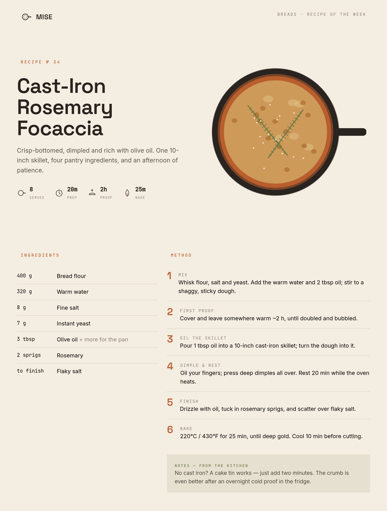 | 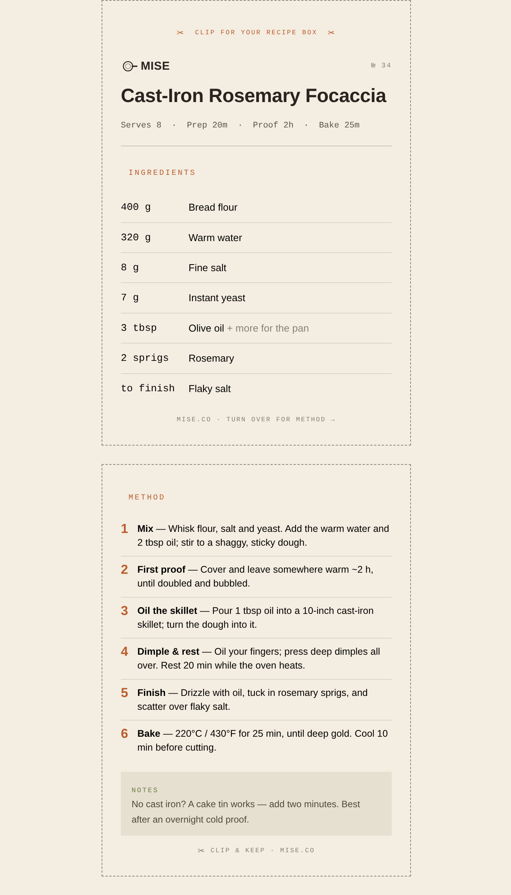 |

---

## Transactional — four workhorses

A supporting set proving the range: the everyday documents businesses actually send.

| | Rate Confirmation | Event Ticket | Invoice + Receipt | Order + Packing Slip |
|---|---|---|---|---|
| Brand | Northwind Freight | Nightshift | Loomly Studio | Trailhead Goods |
| Email | 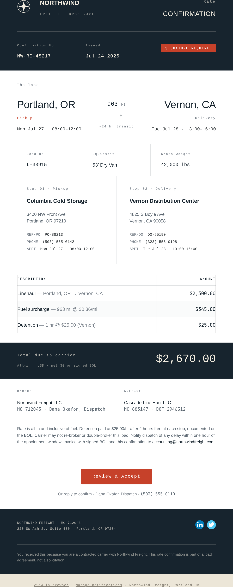 | 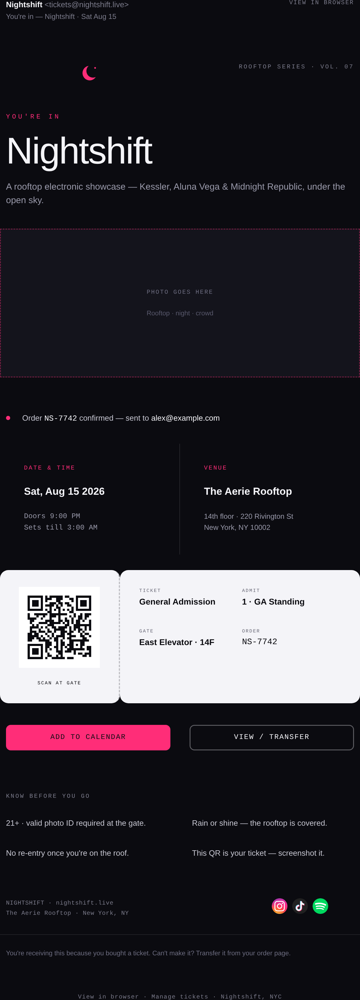 | 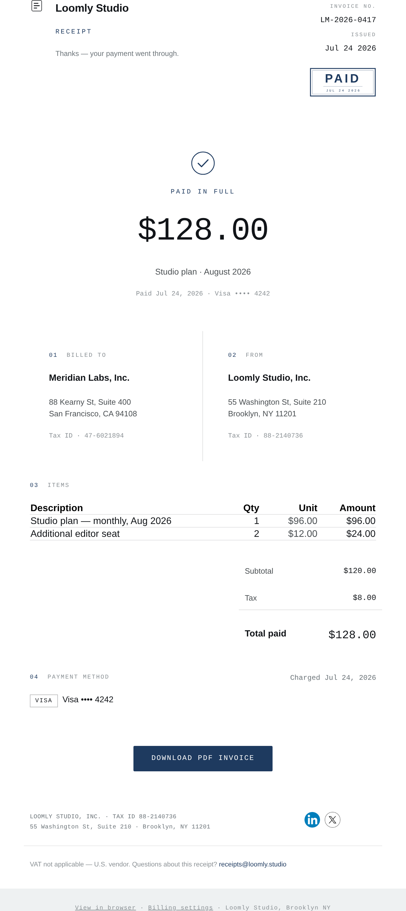 | 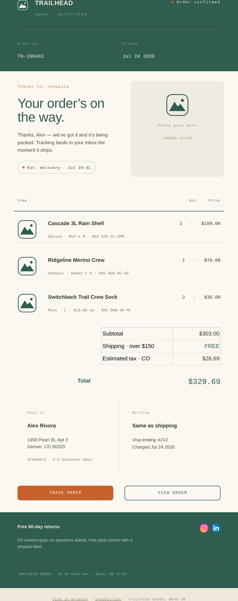 |
| Print PDF | 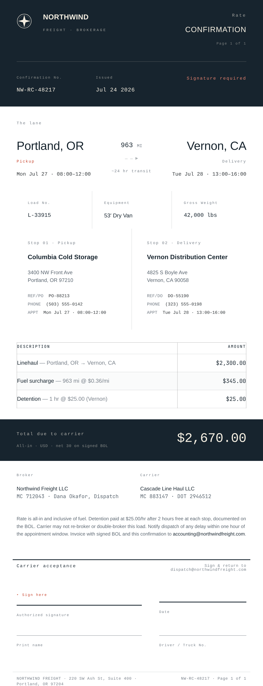 | 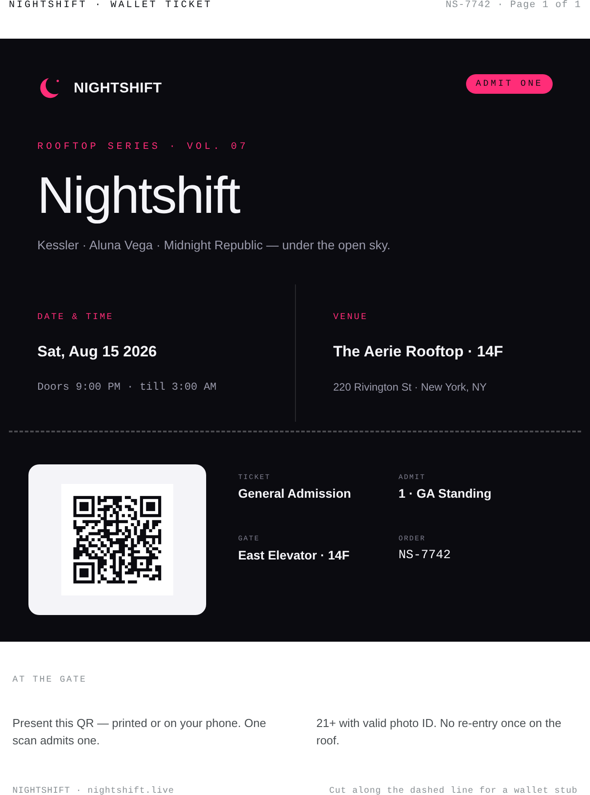 | 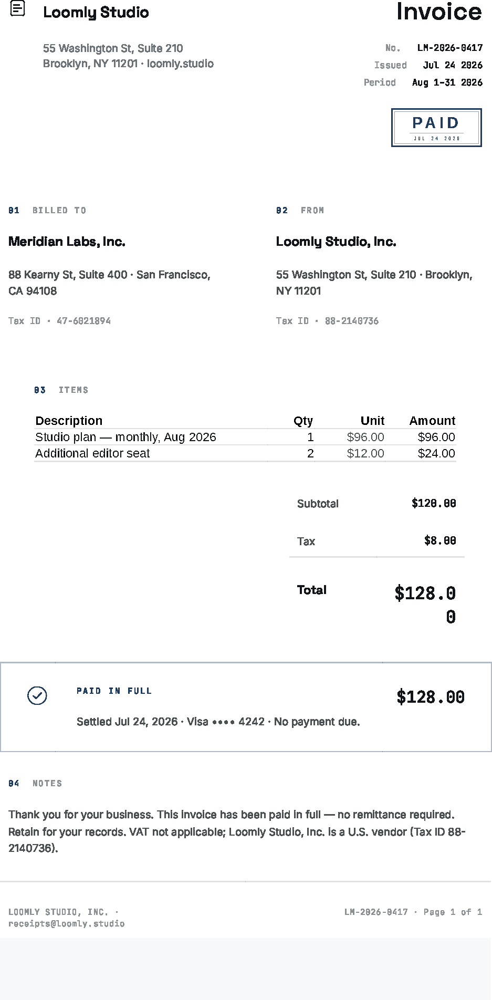 | 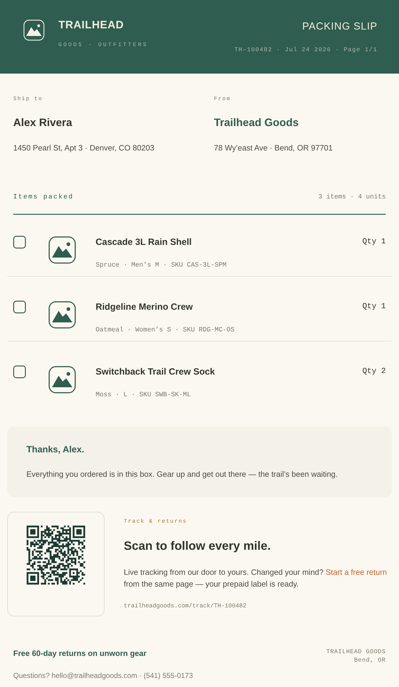 |

---

## How it works

`<Root mode>` swaps the wrapper that sets Unlayer's render mode — `<Email>` (table-based,
Outlook/Gmail-safe), `<Page>` (responsive flexbox), or `<Document>` (print/PDF). Each
template is one function that branches on `mode` for the deltas each surface needs (a
teaser vs. a full scroll-story vs. a poster). Everything is composed from Elements' fixed
blocks under strict `Body → Row → Column → item` nesting; charts, plates, illustrations,
and floor plans are exported SVG `Image` assets, never drawn geometry.

```tsx
export default function Cadence({ mode }: { mode: Mode }) {
  if (mode === 'email') return <Root mode={mode} …>{/* teaser */}</Root>;
  if (mode === 'document') return <Root mode={mode} …>{/* poster */}</Root>;
  return <Root mode={mode} …>{/* web scroll-story */}</Root>;
}
```

## Quick start

```bash
npm install
npm run build      # → dist/<template>/{email,page,document}.html + email.txt + design.json
npm run pdf        # → dist/<template>/document.pdf   (headless Chromium, no API key)
npm run shots      # → docs/screenshots/*.png         (needs ImageMagick)
npm run emailsim   # → qa/gmail-sim/*.png              (renders each email the way Gmail would)
npm run raster     # → design/assets/*.png             (regenerate PNG twins; needs librsvg)
npm run typecheck
```

Open any `dist/<template>/{email,page,document}.html` straight in a browser, or drop
`design.json` into the Unlayer visual editor to keep editing.

## Project structure

```
src/
  lib/root.tsx            <Root mode> → Email | Page | Document; shared font stacks (+ serif)
  templates/*.tsx         eight templates — four showcase, four transactional
  build.tsx               renders every template × every mode → dist/
scripts/                  one (single-template dev build) · pdf · shots · rasterize · emailsim
design/                   the Claude Design source bundles + brand/SVG assets
docs/screenshots/         full-page captures used above
dist/                     rendered output (email/web/pdf per template)
```

## Notes

- **Fonts:** web/PDF load Space Grotesk · Inter · JetBrains Mono · Fraunces/EB Garamond
  (serif) from Google Fonts; email clients fall back to web-safe stacks (expected).
- **Images in real email:** `dist` references assets by relative path for local preview.
  For an actual send, host `assets/` on a CDN and use absolute URLs.
- **No SVG in email.** Gmail, Outlook and Yahoo don't render ``, so the
  email build swaps every SVG for a PNG twin (`npm run raster`, committed under
  `design/assets/`). Web and print keep the vectors. `build.tsx` fails the build if an
  email references a PNG that hasn't been generated.
- **No grid or flexbox in email.** Mail clients strip `display:grid` / `display:flex`,
  which silently collapses a multi-column block into one column. Every email layout is
  built from `<table role="presentation">`; grid and flex are used only on the web and
  print surfaces. `npm run emailsim` re-renders each email with the properties Gmail
  removes actually removed, so a regression shows up as a broken screenshot rather than
  in someone's inbox — it currently reports **0 stripped declarations** across all eight.
- **Message size.** Gmail clips a message body over ~102 KB. The largest email here is
  ~75 KB of rendered markup (the raw files run bigger, but the extra is Outlook
  conditional comments and a `<style>` block that never reach Gmail).

## Credits

- Built with [Unlayer Elements](https://github.com/unlayer/elements), MIT.
- Fonts: Space Grotesk · Inter · JetBrains Mono · Fraunces · EB Garamond (OFL).
- All brands, names, and figures are fictional, for demonstration only.

## License

MIT — see [LICENSE](LICENSE). **#BuiltWithElements**
